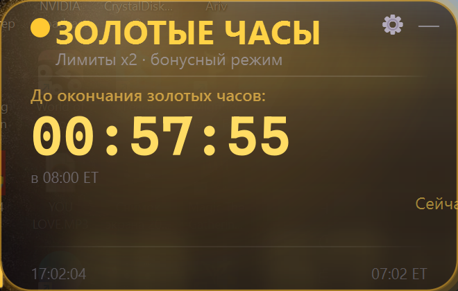

# Claude Golden Hours Widget

<div align="center">



**Виджет-напоминалка для тех, кто не хочет платить за токены полную цену.**

*Потому что настоящий AI-энтузиаст знает, когда Claude раздаёт двойные порции.*

</div>

---

## Что это?

Windows-виджет в стиле **Liquid Glass**, который показывает обратный отсчёт до **золотых часов Claude** — периодов, когда лимиты удваиваются и использование не считается в недельную квоту.

> Акция действует **с 13 по 28 марта 2026 года**. После этого виджет станет красивым напоминанием о том, как вы экономили токены как профи.

## Золотые часы — что за зверь?

По [акции Claude March 2026](https://support.claude.com/en/articles/14063676-claude-march-2026-usage-promotion):

| Время (ET) | Режим | Лимиты |
|---|---|---|
| **До 08:00** | Золотые часы | **x2** |
| 08:00 — 14:00 | Пиковые часы | Обычные |
| **После 14:00** | Золотые часы | **x2** |
| Выходные | Всегда золото | **x2** |

Работает на: Free, Pro, Max, Team (Enterprise — нет, у них и так всё хорошо).

## Возможности

- **Liquid Glass UI** — frosted blur с золотым свечением, как будто Apple делала виджет для нейросети
- **Обратный отсчёт** — чётко видно: "До начала золотых часов" или "До окончания золотых часов"
- **Компактный режим** — при сворачивании вместо исчезновения показывается тонкая полоска над треем с таймером и статусом (включён по умолчанию, двойной клик разворачивает)
- **Бегущая строка** — мотивационные фразы типа "Двойной лимит активен, жги токены!" и "Готовь промпты, скоро x2!"
- **Автовсплытие** — виджет сам выскакивает из трея когда начинаются золотые часы и за 10 минут до их конца
- **Звуковые уведомления** — восходящее арпеджио C-E-G при начале золотых часов (нисходящее при пиковых, чтобы было грустно)
- **Системный трей** — сворачивается, живёт в трее, иконка меняется по состоянию
- **Настройки** — всё отключается: звук, popup, бегущая строка, компактный режим, автозапуск с Windows
- **Перетаскивание** — виджет можно двигать куда угодно, позиция сохраняется

## Установка

### Вариант 1: Готовый exe (рекомендуется)

Скачайте `dist/ClaudeGoldenHours.exe` из репозитория и запустите. Python не нужен.

### Вариант 2: Из исходников

```bash
git clone https://github.com/katochimotor/claudegoldenhours.git
cd claudegoldenhours
pip install -r requirements.txt
python main.py
```

### Требования (для варианта 2)
- **Windows 10/11**
- **Python 3.9+**
- PyQt5, pystray, Pillow

## Управление

| Действие | Как |
|---|---|
| Свернуть в трей | Кнопка `—` или ПКМ → "Свернуть в трей" |
| Настройки | Кнопка `⚙` или ПКМ → "Настройки" |
| Передвинуть | Перетащить мышкой |
| Развернуть из компактного режима | Двойной клик по полоске над треем |
| Развернуть из трея | Клик по иконке в трее |
| Выход | ПКМ → "Выход" |

## Файловая структура

```
├── main.py              # Точка входа
├── widget.py            # Liquid Glass виджет (основной)
├── compact_widget.py    # Компактная полоска над треем
├── logic.py             # Расчёт золотых часов + фразы
├── glass.py             # DWM эффекты (для совместимости)
├── tray.py              # Системный трей
├── sound.py             # Звуковые уведомления
├── settings.py          # Персистентные настройки
├── settings_dialog.py   # Окно настроек
├── autostart.py         # Автозапуск Windows
├── requirements.txt
└── dist/
    └── ClaudeGoldenHours.exe  # Готовый exe для Windows
```

## Совместимость

Протестировано на Windows 11 с Start11. Виджет не использует DWM Acrylic (несовместим с кастомными shell-ами), вместо этого — собственный frosted blur через захват экрана.

---

<div align="center">

**Актуально до 28 марта 2026 года**

*Потом можете удалить. Или оставить как памятник вашей бережливости.*

Сделано с помощью Claude. Ирония? Нет, эффективность.

</div>
